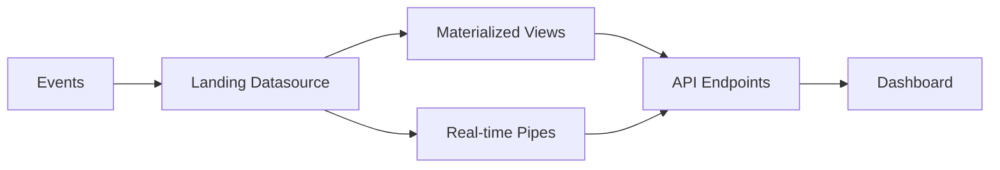

## System Architecture

The Tinybird Web Analytics Starter Kit uses a **Lambda Architecture** pattern optimized for real-time analytics. The system processes web analytics events through three main layers:

### Data Flow



## Core Components

### 1. Landing Datasource

**analytics_events** serves as the primary ingestion point for all web analytics events:

- Accepts raw event data with minimal processing
- Partitioned by month: `toYYYYMM(timestamp)`
- Sorted by: `tenant_id`, `domain`, `timestamp`
- Optimized for high-throughput writes

### 2. Processing Layer

The **analytics_hits** pipe transforms raw events:

- Parses JSON payloads to extract structured fields
- Detects device types (desktop, mobile-android, mobile-ios, bot)
- Identifies browsers (chrome, firefox, safari, opera, ie)
- Handles domain resolution with fallback logic
- Filters out bot traffic

### 3. Materialization Layer

Five materialized views pre-aggregate data for fast queries:

<CardGroup cols={2}>
  <Card title="Pages" icon="file">
    Aggregates page-level metrics by date, tenant, domain, device, browser, location, and pathname
  </Card>
  <Card title="Sessions" icon="users">
    Tracks session metrics including first/last hit times and total hits per session
  </Card>
  <Card title="Sources" icon="arrow-up-right-from-square">
    Aggregates traffic sources and referrers with visit and hit counts
  </Card>
  <Card title="Tenant Actions" icon="bolt">
    Maintains distinct action types per tenant/domain with occurrence counts
  </Card>
  <Card title="Tenant Domains" icon="globe">
    Tracks active domains per tenant with first/last seen timestamps
  </Card>
</CardGroup>

### 4. API Layer

Endpoints serve pre-aggregated data from materialized views and real-time data from the processing layer:

- **Real-time endpoints**: Query `analytics_hits` directly for live data
- **Historical endpoints**: Query materialized views for aggregated metrics
- **Hybrid endpoints**: Combine both for flexible date ranges

## Multi-tenancy Design

The architecture supports multi-tenancy through:

<CodeGroup>
```typescript Schema Design
schema: {
  timestamp: t.dateTime(),
  tenant_id: t.string().default(""),
  domain: t.string().default(""),
  // ... other fields
}
```

```typescript Sorting Keys
engine: engine.mergeTree({
  partitionKey: "toYYYYMM(timestamp)",
  sortingKey: ["tenant_id", "domain", "timestamp"],
})
```
</CodeGroup>

**Benefits:**

- Efficient data isolation via `tenant_id` filtering
- Multi-domain support within each tenant
- Optimized query performance through proper sorting

## Performance Optimizations

### Partitioning Strategy

All datasources use monthly partitioning:

```sql
partitionKey: "toYYYYMM(timestamp)"
```

This enables:
- Fast data pruning for date-range queries
- Efficient data lifecycle management
- Optimal storage compression

### Aggregate Functions

Materialized views use ClickHouse aggregate functions:

| Function Type | Use Case | Example |
|--------------|----------|----------|
| `aggregateFunction` | Mergeable aggregates | `uniq`, `count` |
| `simpleAggregateFunction` | Simple aggregates | `any`, `min`, `max` |

<Note>
**Performance Tip**: Materialized views enable sub-second queries on historical data by pre-computing aggregations at write time.
</Note>

### Sorting Keys

Carefully chosen sorting keys optimize common query patterns:

```typescript
sortingKey: [
  "tenant_id",    // Primary filter
  "domain",       // Secondary filter
  "date",         // Time-range queries
  "device",       // Grouping dimension
  "browser",      // Grouping dimension
  "location",     // Grouping dimension
  "pathname",     // High-cardinality dimension last
]
```

## Data Retention

<Warning>
Implement TTL policies based on your retention requirements. Raw events in the landing datasource consume more storage than materialized views.
</Warning>

Recommended retention strategy:

- **Landing datasource** (analytics_events): 30-90 days
- **Materialized views**: 1-2 years
- **Aggregate rollups**: Indefinite

## Scalability Considerations

### Write Throughput

The architecture handles high write volumes through:

1. **Minimal landing transformation**: Raw events written directly
2. **Async materialization**: Background aggregation doesn't block writes
3. **Efficient engines**: MergeTree and AggregatingMergeTree optimize for writes

### Query Performance

1. **Pre-aggregated data**: Materialized views serve most queries
2. **Indexed sorting keys**: Fast filtering on common dimensions
3. **Partition pruning**: Date filters leverage partitioning

### Resource Management

<Tip>
Materialized views consume CPU during materialization. Monitor resource usage and adjust refresh intervals if needed.
</Tip>

## Next Steps

<CardGroup cols={2}>
  <Card title="Datasources" icon="database" href="/data-platform/datasources">
    Explore detailed schema definitions
  </Card>
  <Card title="Pipes" icon="pipe" href="/data-platform/pipes">
    Learn about data transformation logic
  </Card>
  <Card title="Materialized Views" icon="layer-group" href="/data-platform/materialized-views">
    Understand aggregation strategies
  </Card>
</CardGroup>