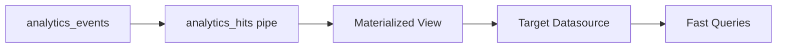

## Overview

Materialized Views (MVs) are **incremental aggregation pipelines** that continuously transform data from the `analytics_hits` pipe into pre-computed metrics. They enable sub-second query performance on historical data.

<Info>
The Web Analytics Starter Kit includes **5 materialized views** that power different analytics dashboards and reports.
</Info>

## How Materialized Views Work



<Steps>
  <Step title="Data arrives">
    New events land in `analytics_events` datasource
  </Step>
  <Step title="Transformation">
    Events flow through the `analytics_hits` pipe for parsing and enrichment
  </Step>
  <Step title="Aggregation">
    Materialized view applies aggregation logic using ClickHouse aggregate functions
  </Step>
  <Step title="Storage">
    Aggregated data is stored in the target datasource (AggregatingMergeTree)
  </Step>
  <Step title="Querying">
    Endpoints query pre-aggregated data for instant results
  </Step>
</Steps>

---

## analytics_pages

Aggregates page-level metrics by pathname, device, browser, and location.

<CodeGroup>
```typescript Definition
export const analyticsPages = defineMaterializedView("analytics_pages", {
  datasource: analyticsPagesMv,
  nodes: [
    node({
      name: "analytics_pages_1",
      description: "Aggregate by pathname and calculate session and hits",
      sql: `
        SELECT
            toDate(timestamp) AS date,
            tenant_id,
            domain,
            device,
            browser,
            location,
            pathname,
            uniqState(session_id) AS visits,
            countState() AS hits
        FROM analytics_hits
        GROUP BY date, tenant_id, domain, device, browser, location, pathname
      `,
    }),
  ],
});
```

```sql Equivalent ClickHouse SQL
CREATE MATERIALIZED VIEW analytics_pages
TO analytics_pages_mv
AS
SELECT
    toDate(timestamp) AS date,
    tenant_id,
    domain,
    device,
    browser,
    location,
    pathname,
    uniqState(session_id) AS visits,
    countState() AS hits
FROM analytics_hits
GROUP BY date, tenant_id, domain, device, browser, location, pathname;
```
</CodeGroup>

### Aggregation Dimensions

<ResponseField name="date" type="Date">
  Daily aggregation - converts timestamp to date
</ResponseField>

<ResponseField name="pathname" type="String">
  Page URL path (e.g., `/home`, `/products/item-123`)
</ResponseField>

<ResponseField name="device" type="String">
  Device type: `desktop`, `mobile-android`, `mobile-ios`, `bot`
</ResponseField>

<ResponseField name="browser" type="String">
  Browser: `chrome`, `firefox`, `safari`, `opera`, `ie`, `Unknown`
</ResponseField>

<ResponseField name="location" type="String">
  Country code (e.g., `US`, `GB`, `DE`)
</ResponseField>

### Metrics

<ResponseField name="visits" type="AggregateFunction(uniq)">
  **Unique visitors** (unique session_id count)
  
  **Query with**: `uniqMerge(visits)`
  
  ```sql
  SELECT pathname, uniqMerge(visits) as unique_visitors
  FROM analytics_pages_mv
  GROUP BY pathname
  ```
</ResponseField>

<ResponseField name="hits" type="AggregateFunction(count)">
  **Page views** (total hit count)
  
  **Query with**: `countMerge(hits)`
  
  ```sql
  SELECT pathname, countMerge(hits) as total_pageviews
  FROM analytics_pages_mv
  GROUP BY pathname
  ```
</ResponseField>

### Use Cases

<CardGroup cols={2}>
  <Card title="Top Pages Report" icon="chart-bar">
    Most visited pages ranked by traffic
    
    ```sql
    SELECT pathname, uniqMerge(visits)
    FROM analytics_pages_mv
    GROUP BY pathname
    ORDER BY uniqMerge(visits) DESC
    LIMIT 10
    ```
  </Card>
  
  <Card title="Device Breakdown" icon="mobile">
    Page performance by device type
    
    ```sql
    SELECT device, uniqMerge(visits)
    FROM analytics_pages_mv
    WHERE pathname = '/pricing'
    GROUP BY device
    ```
  </Card>
  
  <Card title="Geographic Analysis" icon="globe">
    Traffic distribution by country
    
    ```sql
    SELECT location, uniqMerge(visits)
    FROM analytics_pages_mv
    GROUP BY location
    ORDER BY uniqMerge(visits) DESC
    ```
  </Card>
  
  <Card title="Browser Stats" icon="browser">
    Browser usage across your site
    
    ```sql
    SELECT browser, uniqMerge(visits)
    FROM analytics_pages_mv
    GROUP BY browser
    ```
  </Card>
</CardGroup>

---

## analytics_sessions

Aggregates session-level metrics including duration and hit counts.

<CodeGroup>
```typescript Definition
export const analyticsSessions = defineMaterializedView("analytics_sessions", {
  datasource: analyticsSessionsMv,
  nodes: [
    node({
      name: "analytics_sessions_1",
      description: "Aggregate by session_id and calculate session metrics",
      sql: `
        SELECT
            toDate(timestamp) AS date,
            session_id,
            tenant_id,
            domain,
            anySimpleState(device) AS device,
            anySimpleState(browser) AS browser,
            anySimpleState(location) AS location,
            minSimpleState(timestamp) AS first_hit,
            maxSimpleState(timestamp) AS latest_hit,
            countState() AS hits
        FROM analytics_hits
        GROUP BY date, session_id, tenant_id, domain
      `,
    }),
  ],
});
```
</CodeGroup>

### Aggregation Dimensions

<ResponseField name="session_id" type="String">
  Unique session identifier - primary grouping dimension
</ResponseField>

<ResponseField name="date" type="Date">
  Session date (derived from first hit timestamp)
</ResponseField>

### Metrics

<ResponseField name="device" type="SimpleAggregateFunction(any)">
  Device type for this session (one value per session)
  
  **Query with**: `anySimpleState(device)` (already in correct form)
  
  <Info>Uses `any` because each session has a single device type</Info>
</ResponseField>

<ResponseField name="browser" type="SimpleAggregateFunction(any)">
  Browser for this session
</ResponseField>

<ResponseField name="location" type="SimpleAggregateFunction(any)">
  Geographic location for this session
</ResponseField>

<ResponseField name="first_hit" type="SimpleAggregateFunction(min)">
  **Session start time** (timestamp of first page view)
  
  **Query with**: `minSimpleState(first_hit)`
  
  ```sql
  SELECT session_id, minSimpleState(first_hit) as session_start
  FROM analytics_sessions_mv
  GROUP BY session_id
  ```
</ResponseField>

<ResponseField name="latest_hit" type="SimpleAggregateFunction(max)">
  **Session end time** (timestamp of last page view)
  
  **Query with**: `maxSimpleState(latest_hit)`
  
  <Tip>
    **Session Duration** = `maxSimpleState(latest_hit) - minSimpleState(first_hit)`
  </Tip>
</ResponseField>

<ResponseField name="hits" type="AggregateFunction(count)">
  **Pages per session** (hit count)
  
  **Query with**: `countMerge(hits)`
</ResponseField>

### Use Cases

<CardGroup cols={2}>
  <Card title="Engagement Metrics" icon="chart-line">
    Average pages per session and session duration
    
    ```sql
    SELECT 
      avg(countMerge(hits)) as avg_pages_per_session,
      avg(maxSimpleState(latest_hit) - minSimpleState(first_hit)) as avg_duration
    FROM analytics_sessions_mv
    ```
  </Card>
  
  <Card title="Bounce Rate" icon="arrow-right-from-bracket">
    Sessions with only one page view
    
    ```sql
    SELECT 
      countIf(countMerge(hits) = 1) / count() as bounce_rate
    FROM analytics_sessions_mv
    ```
  </Card>
  
  <Card title="Active Sessions" icon="clock">
    Current active user count (last 5 minutes)
    
    ```sql
    SELECT uniq(session_id) as active_users
    FROM analytics_sessions_mv
    WHERE maxSimpleState(latest_hit) >= now() - interval 5 minute
    ```
  </Card>
  
  <Card title="Session Distribution" icon="chart-histogram">
    Distribution of session lengths
    
    ```sql
    SELECT 
      countMerge(hits) as pages,
      count() as session_count
    FROM analytics_sessions_mv
    GROUP BY pages
    ORDER BY pages
    ```
  </Card>
</CardGroup>

---

## analytics_sources

Aggregates traffic sources and referrer metrics.

<CodeGroup>
```typescript Definition
export const analyticsSources = defineMaterializedView("analytics_sources", {
  datasource: analyticsSourcesMv,
  nodes: [
    node({
      name: "analytics_sources_1",
      description: "Aggregate by referral and calculate session and hits",
      sql: `
        SELECT
            toDate(timestamp) AS date,
            tenant_id,
            domain,
            device,
            browser,
            location,
            referrer,
            uniqState(session_id) AS visits,
            countState() AS hits
        FROM analytics_hits
        WHERE domainWithoutWWW(referrer) != current_domain
        GROUP BY date, tenant_id, domain, device, browser, location, referrer
      `,
    }),
  ],
});
```
</CodeGroup>

### Key Feature: External Traffic Only

<Warning>
**Filtering Logic**: The materialized view **excludes same-domain referrers**:

```sql
WHERE domainWithoutWWW(referrer) != current_domain
```

This ensures only **external traffic sources** are tracked, filtering out internal navigation.
</Warning>

### Aggregation Dimensions

<ResponseField name="referrer" type="String">
  Full referrer URL from external sources
  
  **Examples**:
  - `https://google.com/search?q=...`
  - `https://twitter.com/user/status/123`
  - `https://news.ycombinator.com`
</ResponseField>

### Use Cases

<CardGroup cols={2}>
  <Card title="Top Referrers" icon="arrow-up-right-from-square">
    Most valuable traffic sources
    
    ```sql
    SELECT 
      domainWithoutWWW(referrer) as source,
      uniqMerge(visits) as visitors
    FROM analytics_sources_mv
    GROUP BY source
    ORDER BY visitors DESC
    LIMIT 10
    ```
  </Card>
  
  <Card title="Traffic Source Trends" icon="chart-line">
    How sources perform over time
    
    ```sql
    SELECT 
      date,
      domainWithoutWWW(referrer) as source,
      uniqMerge(visits) as daily_visitors
    FROM analytics_sources_mv
    GROUP BY date, source
    ORDER BY date
    ```
  </Card>
  
  <Card title="Device by Source" icon="mobile-screen">
    Which devices each source drives
    
    ```sql
    SELECT 
      domainWithoutWWW(referrer) as source,
      device,
      uniqMerge(visits) as visitors
    FROM analytics_sources_mv
    GROUP BY source, device
    ```
  </Card>
  
  <Card title="Campaign Analysis" icon="bullhorn">
    Track specific campaign URLs
    
    ```sql
    SELECT uniqMerge(visits) as visitors
    FROM analytics_sources_mv
    WHERE referrer LIKE '%utm_campaign=launch%'
    ```
  </Card>
</CardGroup>

---

## tenant_actions

Tracks all distinct action types across tenants and domains.

<CodeGroup>
```typescript Definition
export const tenantActions = defineMaterializedView("tenant_actions", {
  description: "Materializes distinct actions by tenant and domain",
  datasource: tenantActionsMv,
  nodes: [
    node({
      name: "tenant_actions_node",
      description: "Aggregate distinct actions per tenant/domain",
      sql: `
        with 
          multiIf(
            domain != '', domain, 
            current_domain != '', current_domain, 
            domain_from_payload
          ) as domain,
          JSONExtractString(payload, 'domain') as domain_from_payload,
          if(
            domainWithoutWWW(href) = '' and href is not null and href != '', 
            URLHierarchy(href)[1], 
            domainWithoutWWW(href)
          ) as current_domain,
          JSONExtractString(payload, 'href') as href
        SELECT
            tenant_id,
            domain,
            action,
            anySimpleState(payload) AS last_payload,
            maxSimpleState(timestamp) AS last_seen,
            countState() AS total_occurrences
        FROM analytics_events
        GROUP BY tenant_id, domain, action
      `,
    }),
  ],
});
```
</CodeGroup>

### Key Feature: Direct from analytics_events

<Info>
**Important**: This MV reads directly from `analytics_events` (not `analytics_hits`) to capture **all action types**, not just `page_hit` events.
</Info>

### Aggregation Dimensions

<ResponseField name="action" type="String">
  Event action type
  
  **Common actions**:
  - `page_hit` - Page views
  - `button_click` - Button interactions
  - `form_submit` - Form submissions
  - `custom_event` - Custom tracking events
</ResponseField>

### Metrics

<ResponseField name="last_payload" type="SimpleAggregateFunction(any)">
  Sample payload from most recent occurrence
  
  **Use for**: Understanding event structure and parameters
</ResponseField>

<ResponseField name="last_seen" type="SimpleAggregateFunction(max)">
  Most recent timestamp for this action
  
  **Use for**: Activity monitoring and stale action detection
</ResponseField>

<ResponseField name="total_occurrences" type="AggregateFunction(count)">
  Total count of this action
  
  **Query with**: `countMerge(total_occurrences)`
</ResponseField>

### Use Cases

<CardGroup cols={2}>
  <Card title="Action Discovery" icon="magnifying-glass">
    Find all tracked events in your application
    
    ```sql
    SELECT 
      action,
      countMerge(total_occurrences) as total
    FROM tenant_actions_mv
    WHERE tenant_id = 'my-tenant'
    GROUP BY action
    ORDER BY total DESC
    ```
  </Card>
  
  <Card title="Event Schema Inspection" icon="code">
    View sample payloads for each action type
    
    ```sql
    SELECT 
      action,
      anySimpleState(last_payload) as example_payload
    FROM tenant_actions_mv
    WHERE tenant_id = 'my-tenant'
    GROUP BY action
    ```
  </Card>
  
  <Card title="Activity Monitoring" icon="chart-line">
    Detect inactive or new action types
    
    ```sql
    SELECT 
      action,
      maxSimpleState(last_seen) as last_occurrence
    FROM tenant_actions_mv
    WHERE tenant_id = 'my-tenant'
    GROUP BY action
    HAVING last_occurrence < now() - interval 7 day
    ```
  </Card>
  
  <Card title="Domain-specific Events" icon="filter">
    Filter actions by domain
    
    ```sql
    SELECT action, countMerge(total_occurrences)
    FROM tenant_actions_mv
    WHERE tenant_id = 'my-tenant' 
      AND domain = 'app.example.com'
    GROUP BY action
    ```
  </Card>
</CardGroup>

---

## tenant_domains

Tracks active domains for each tenant with first/last seen timestamps.

<CodeGroup>
```typescript Definition
export const tenantDomains = defineMaterializedView("tenant_domains", {
  description: "Materializes domain data from analytics hits",
  datasource: tenantDomainsMv,
  nodes: [
    node({
      name: "tenant_domains_node",
      description: "Aggregate domains per tenant with timestamps",
      sql: `
        SELECT
            tenant_id,
            domain,
            minSimpleState(timestamp) AS first_seen,
            maxSimpleState(timestamp) AS last_seen,
            countState() AS total_hits
        FROM analytics_hits
        GROUP BY tenant_id, domain
      `,
    }),
  ],
});
```
</CodeGroup>

### Aggregation Dimensions

<ResponseField name="tenant_id" type="String">
  Tenant identifier
</ResponseField>

<ResponseField name="domain" type="String">
  Domain name (e.g., `example.com`, `app.example.com`)
</ResponseField>

### Metrics

<ResponseField name="first_seen" type="SimpleAggregateFunction(min)">
  **First activity timestamp** for this domain
  
  **Query with**: `minSimpleState(first_seen)`
  
  <Tip>Use for onboarding tracking and domain age analysis</Tip>
</ResponseField>

<ResponseField name="last_seen" type="SimpleAggregateFunction(max)">
  **Most recent activity timestamp** for this domain
  
  **Query with**: `maxSimpleState(last_seen)`
  
  <Tip>Use for activity monitoring and inactive domain detection</Tip>
</ResponseField>

<ResponseField name="total_hits" type="AggregateFunction(count)">
  **Total hit count** across all time
  
  **Query with**: `countMerge(total_hits)`
</ResponseField>

### Use Cases

<CardGroup cols={2}>
  <Card title="Domain Listing" icon="list">
    List all domains for a tenant
    
    ```sql
    SELECT 
      domain,
      minSimpleState(first_seen) as created_at,
      maxSimpleState(last_seen) as last_active,
      countMerge(total_hits) as total_traffic
    FROM tenant_domains_mv
    WHERE tenant_id = 'my-tenant'
    GROUP BY domain
    ORDER BY last_active DESC
    ```
  </Card>
  
  <Card title="Inactive Domains" icon="clock">
    Find domains with no recent activity
    
    ```sql
    SELECT domain, maxSimpleState(last_seen) as last_active
    FROM tenant_domains_mv
    WHERE tenant_id = 'my-tenant'
    GROUP BY domain
    HAVING last_active < now() - interval 30 day
    ```
  </Card>
  
  <Card title="Domain Analytics" icon="chart-bar">
    Compare traffic across tenant domains
    
    ```sql
    SELECT 
      domain,
      countMerge(total_hits) as hits
    FROM tenant_domains_mv
    WHERE tenant_id = 'my-tenant'
    GROUP BY domain
    ORDER BY hits DESC
    ```
  </Card>
  
  <Card title="Onboarding Tracking" icon="user-plus">
    Monitor new domain additions
    
    ```sql
    SELECT 
      domain,
      minSimpleState(first_seen) as onboarded_at
    FROM tenant_domains_mv
    WHERE tenant_id = 'my-tenant'
      AND minSimpleState(first_seen) >= now() - interval 7 day
    GROUP BY domain
    ```
  </Card>
</CardGroup>

---

## Aggregate Function Reference

### Regular Aggregate Functions

Require `-Merge` suffix when querying:

<CodeGroup>
```sql uniqState / uniqMerge
-- In materialized view
uniqState(session_id) AS visits

-- In query
SELECT uniqMerge(visits) FROM analytics_pages_mv
```

```sql countState / countMerge
-- In materialized view
countState() AS hits

-- In query
SELECT countMerge(hits) FROM analytics_pages_mv
```

```sql sumState / sumMerge
-- In materialized view
sumState(value) AS total_value

-- In query
SELECT sumMerge(total_value) FROM my_mv
```
</CodeGroup>

### Simple Aggregate Functions

No special suffix needed:

<CodeGroup>
```sql anySimpleState
-- In materialized view
anySimpleState(device) AS device

-- In query
SELECT anySimpleState(device) FROM analytics_sessions_mv
-- Or simply: SELECT device FROM analytics_sessions_mv
```

```sql minSimpleState
-- In materialized view
minSimpleState(timestamp) AS first_hit

-- In query
SELECT minSimpleState(first_hit) FROM analytics_sessions_mv
```

```sql maxSimpleState
-- In materialized view
maxSimpleState(timestamp) AS last_hit

-- In query
SELECT maxSimpleState(last_hit) FROM analytics_sessions_mv
```
</CodeGroup>

<Note>
**Choosing between Simple and Regular**:
- Use **Simple** for: `any`, `min`, `max` (lower overhead)
- Use **Regular** for: `uniq`, `count`, `sum`, `avg` (more flexibility)
</Note>

---

## Performance Best Practices

### Query Optimization

<AccordionGroup>
  <Accordion title="1. Filter by Sorting Key" icon="key">
    Always filter by the first columns in the sorting key:
    
    ```sql
    -- Good: Uses sorting key efficiently
    WHERE tenant_id = 'x' AND domain = 'y' AND date >= '2024-01-01'
    
    -- Bad: Skips sorting key columns
    WHERE pathname = '/home' AND date >= '2024-01-01'
    ```
    
    <Tip>Check datasource sorting keys in the [Datasources documentation](/data-platform/datasources)</Tip>
  </Accordion>
  
  <Accordion title="2. Use Partition Pruning" icon="scissors">
    Include date filters to leverage partitioning:
    
    ```sql
    -- Good: Prunes partitions
    WHERE date >= '2024-01-01' AND date <= '2024-01-31'
    
    -- Bad: Scans all partitions
    WHERE domain = 'example.com'
    ```
  </Accordion>
  
  <Accordion title="3. Aggregate Appropriately" icon="calculator">
    Use correct merge functions:
    
    ```sql
    -- Good: Proper merging
    SELECT uniqMerge(visits), countMerge(hits)
    FROM analytics_pages_mv
    
    -- Bad: Missing merge
    SELECT visits, hits  -- Returns binary aggregate state!
    FROM analytics_pages_mv
    ```
  </Accordion>
  
  <Accordion title="4. Limit Result Sets" icon="filter">
    Always use LIMIT for top-N queries:
    
    ```sql
    -- Good: Bounded result set
    SELECT pathname, uniqMerge(visits)
    FROM analytics_pages_mv
    GROUP BY pathname
    ORDER BY uniqMerge(visits) DESC
    LIMIT 100
    
    -- Bad: Unbounded results
    SELECT pathname, uniqMerge(visits)
    FROM analytics_pages_mv
    GROUP BY pathname
    ```
  </Accordion>
</AccordionGroup>

### Materialization Performance

<Warning>
**Resource Usage**: Materialized views consume CPU and memory during aggregation. Monitor system resources and adjust if needed.
</Warning>

**Optimization tips**:

1. **Reduce dimensions**: Fewer grouping columns = faster aggregation
2. **Batch inserts**: Insert events in batches rather than one-by-one
3. **Monitor lag**: Check materialization lag in Tinybird UI

---

## Extending Materialized Views

### Adding New Dimensions

To add a new grouping dimension:

```typescript Add UTM Source
SELECT
    toDate(timestamp) AS date,
    tenant_id,
    domain,
    pathname,
    JSONExtractString(payload, 'utm_source') as utm_source,  // NEW
    uniqState(session_id) AS visits,
    countState() AS hits
FROM analytics_hits
GROUP BY date, tenant_id, domain, pathname, utm_source  // Add to GROUP BY
```

<Warning>
**Schema Change**: Adding dimensions requires:
1. Updating the target datasource schema
2. Dropping and recreating the materialized view
3. Backfilling historical data (if needed)
</Warning>

### Creating Custom Views

Create domain-specific materialized views:

```typescript E-commerce Example
export const productPageViews = defineMaterializedView("product_page_views", {
  datasource: productPageViewsMv,
  nodes: [
    node({
      name: "product_aggregation",
      sql: `
        SELECT
            toDate(timestamp) AS date,
            tenant_id,
            domain,
            JSONExtractString(payload, 'product_id') as product_id,
            uniqState(session_id) AS unique_viewers,
            countState() AS total_views
        FROM analytics_events
        WHERE action = 'product_view'
        GROUP BY date, tenant_id, domain, product_id
      `,
    }),
  ],
});
```

---

## Monitoring & Debugging

### Check Materialization Status

```sql View Lag
SELECT 
    name,
    total_rows,
    last_insert_time
FROM system.parts
WHERE database = 'your_database'
  AND table LIKE '%_mv'
ORDER BY last_insert_time DESC
```

### Validate Aggregates

Compare materialized view results with source data:

```sql Validation Query
-- From materialized view
SELECT uniqMerge(visits) as mv_visits
FROM analytics_pages_mv
WHERE date = '2024-01-01';

-- From source (should match)
SELECT uniq(session_id) as source_visits
FROM analytics_hits
WHERE toDate(timestamp) = '2024-01-01';
```

<Tip>
Run validation queries periodically to ensure data accuracy.
</Tip>

---

## Next Steps

<CardGroup cols={3}>
  <Card title="Architecture" icon="sitemap" href="/data-platform/architecture">
    Understand how MVs fit in the system
  </Card>
  <Card title="Datasources" icon="database" href="/data-platform/datasources">
    Review MV target datasource schemas
  </Card>
  <Card title="API Endpoints" icon="code" href="/api/current-visitors">
    See how endpoints query materialized views
  </Card>
</CardGroup>