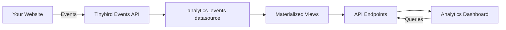

## What is Tinybird Web Analytics?

Tinybird Web Analytics is a complete, production-ready web analytics platform built with privacy and speed as top priorities. It combines real-time event tracking, powerful data processing, and a beautiful pre-built dashboard to give you instant insights into your website traffic.

Unlike traditional analytics solutions, this starter kit gives you full control over your data and infrastructure while maintaining real-time performance at scale.

## Key Features

<CardGroup cols={2}>
  <Card title="Real-Time Analytics" icon="bolt">
    See visitor activity as it happens with sub-second query latency
  </Card>
  <Card title="Privacy-First" icon="shield-check">
    GDPR-compliant tracking with full control over your data
  </Card>
  <Card title="Custom Events" icon="code">
    Track any user interaction with flexible custom event tracking
  </Card>
  <Card title="Web Vitals" icon="gauge-high">
    Monitor Core Web Vitals to optimize user experience
  </Card>
  <Card title="Multi-Tenancy" icon="users">
    Track multiple sites and tenants in a single deployment
  </Card>
  <Card title="Pre-Built Dashboard" icon="chart-line">
    Beautiful Next.js dashboard ready to deploy on Vercel
  </Card>
</CardGroup>

## How It Works

The platform consists of three main components:

### 1. Event Tracking

A lightweight JavaScript tracker (`@tinybirdco/flock.js`) captures page views, custom events, and web vitals from your website with minimal performance impact.

```html
<script
  defer
  src="https://unpkg.com/@tinybirdco/flock.js"
  data-token="YOUR_TRACKER_TOKEN"
></script>
```

### 2. Data Platform

Tinybird processes your events in real-time using a modern data stack:

- **Landing Datasource**: Ingests raw events via Events API
- **Materialized Views**: Pre-aggregates metrics for fast queries
- **API Endpoints**: Exposes typed, high-performance query endpoints

All defined as code using the Tinybird TypeScript SDK.

### 3. Analytics Dashboard

A Next.js application provides a complete analytics interface with:

- Real-time visitor counts
- Traffic trends and KPIs
- Top pages, sources, and locations
- Device and browser breakdowns
- Web vitals monitoring
- Built-in authentication

## What You Get

This starter kit includes everything you need to run your own analytics platform:

- **Tinybird Data Project**: TypeScript-defined datasources, pipes, and endpoints
- **Tracking Script**: NPM package for event collection
- **Next.js Dashboard**: Full-featured analytics UI
- **Authentication**: Built-in basic auth for dashboard access
- **Multi-Tenancy**: Support for tracking multiple domains and tenants
- **Documentation**: Comprehensive guides for setup and customization

## Use Cases

- **Product Analytics**: Track feature usage and user behavior
- **Marketing Analytics**: Measure campaign performance and attribution
- **E-Commerce Tracking**: Monitor conversions and shopping behavior
- **Content Analytics**: Understand which content resonates with your audience
- **Performance Monitoring**: Track Core Web Vitals and page load metrics

## Quick Links

<CardGroup cols={2}>
  <Card title="Quickstart" icon="rocket" href="/quickstart">
    Deploy your analytics platform in 5 minutes
  </Card>
  <Card title="Tracking Setup" icon="radar" href="/tracking/installation">
    Add tracking to your website
  </Card>
  <Card title="API Reference" icon="terminal" href="/api/current-visitors">
    Explore available endpoints
  </Card>
  <Card title="GitHub Repository" icon="github" href="https://github.com/tinybirdco/web-analytics-starter-kit">
    View the source code
  </Card>
</CardGroup>

## Architecture Overview



The platform is designed for:

- **Scalability**: Handle millions of events per day
- **Real-Time**: Sub-second query latency on live data
- **Privacy**: Full data ownership and GDPR compliance
- **Extensibility**: Easy to customize and extend

## Next Steps

<Steps>
  <Step title="Deploy the Data Platform">
    Set up your Tinybird workspace and deploy the data project
  </Step>
  <Step title="Add Tracking">
    Install the tracking script on your website
  </Step>
  <Step title="Launch Dashboard">
    Deploy the analytics dashboard to Vercel or self-host
  </Step>
  <Step title="Customize">
    Extend with custom events and metrics for your use case
  </Step>
</Steps>

Ready to get started? Head to the [Quickstart guide](/quickstart) to deploy your analytics platform.
